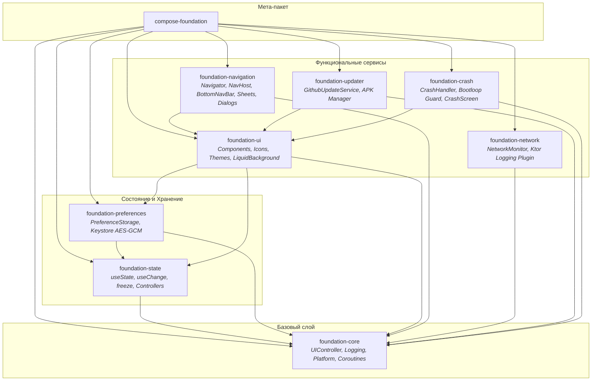

<div align="center">

<br />

<!-- 1. Закругленная иконка проекта -->


# COMPOSE FOUNDATION

Модульный мультиплатформенный архитектурный инструментарий, реактивные хуки и UI-компоненты для Compose Multiplatform.

<br />

<!-- 2. Информационные чипсы -->


<br />

<!-- 3. Кнопки дистрибуции -->
[](https://github.com/whatrushki/compose-foundation/packages)
&nbsp;
[](https://github.com/whatrushki/compose-foundation/releases)
&nbsp;
[](https://github.com/whatrushki)

<br />
</div>

---

### О проекте

**Compose Foundation** — высокопроизводительная библиотека общего назначения, созданная инженерами WHAT Technologies для ускорения и стандартизации разработки кроссплатформенных приложений на Kotlin Multiplatform (Android, JVM Desktop, iOS, WebAssembly).

Библиотека инкапсулирует проверенные практикой архитектурные паттерны: безопасное хранилище настроек с аппаратным шифрованием (Android Keystore), React-style хуки состояния для Compose (`useState`, `useChange`), полнофункциональную подсистему автообновлений через GitHub Releases, инспектор сетевого трафика Ktor и устойчивый к bootloop перехватчик сбоев.

#### Ключевые возможности

* **Полная мультиплатформенность** — единый API и скомпилированные таргеты для Android (AAR), JVM Desktop, iOS (arm64, simulator, x64) и Wasm Browser.
* **Модульная архитектура** — подключайте только необходимые компоненты (`state`, `preferences`, `network`, `ui`, `updater`, `crash`) или мета-пакет `compose-foundation`.
* **DX-ориентированные реактивные хуки** — эргономичные примитивы `useState`, `useChange`, `useEffect` и `freeze` для быстрого прототипирования и декларативного управления состоянием.
* **Защищенные настройки (Secure Key-Value)** — реактивное хранилище на базе AES-GCM с интеграцией Android Keystore и JSON-персистентностью на Desktop/Web.
* **Безопасные обновления** — автоматическая проверка релизов, параллельное скачивание с поддержкой докачки и валидация целостности APK перед установкой.
* **Инспектор трафика и мониторинг** — перехватчик сетевых вызовов Ktor с защитой от утечек авторизационных токенов и защитой от OOM.
* **Отказоустойчивость (Crash Protection)** — перехват необработанных исключений с детекцией цикличных падений (bootloop) и безопасной ротацией логов.

---

### Архитектура и модули

Модульная структура позволяет гибко управлять зависимостями и не перегружать конечное приложение сторонними библиотеками:



| Модуль | Описание | Основные сущности |
| :--- | :--- | :--- |
| **`:foundation-core`** | Ядро архитектуры, логирование, платформенные утилиты | `UIController`, `AppLogger`, `Auditor`, `TimeUtils`, `AppUtils` |
| **`:foundation-state`** | Реактивные хуки и контроллеры оконных состояний | `useState`, `useChange`, `freeze`, `DialogController`, `SheetController` |
| **`:foundation-preferences`** | Потокобезопасное типизированное хранилище | `PreferenceStorage`, `AndroidPreferenceEncryptor`, `KeyValueStorage` |
| **`:foundation-ui`** | Базовые компоненты, анимации, темы и иконки | `SearchBox`, `StyledTextField`, `AdvancedLiquidBackground`, `WHATIcons` |
| **`:foundation-navigation`** | Типобезопасная KMP-навигация, шторки, Bottom/SideBar | `Navigator`, `NavigationHost`, `BottomNavBar`, `SheetNavigator`, `ProvideGlobalDialog` |
| **`:foundation-network`** | Мониторинг сети и инспекция HTTP-трафика | `NetworkMonitor`, `LoggedRequest`, `HttpLoggingPlugin` |
| **`:foundation-updater`** | Автообновление приложений с GitHub | `GithubUpdateService`, `GitHubUpdateManager`, `DownloadProgress` |
| **`:foundation-crash`** | Перехватчик крашей и экран отчета об ошибке | `CrashHandler`, `CurrentActivityHolder`, `CrashScreen` |
| **`:compose-foundation`** | Umbrella-артефакт (включает все модули транзитивно) | `ComposeFoundation` |

---

### Подключение в проект

#### 1. Настройка репозитория GitHub Packages

Добавьте репозиторий GitHub Packages организации `whatrushki` в `settings.gradle.kts`:

```kotlin
dependencyResolutionManagement {
    repositories {
        google()
        mavenCentral()
        maven {
            url = uri("https://maven.pkg.github.com/whatrushki/compose-foundation")
            credentials {
                username = providers.gradleProperty("gpr.user").orNull ?: System.getenv("GITHUB_ACTOR")
                password = providers.gradleProperty("gpr.key").orNull ?: System.getenv("GITHUB_TOKEN")
            }
        }
    }
}
```

#### 2. Подключение зависимостей

Подключите полный комплект или отдельные модули в вашем `build.gradle.kts`:

```kotlin
// Полный комплект всех компонентов:
implementation("app.what.foundation:compose-foundation:1.0.0")

// Или точечно по модулям:
implementation("app.what.foundation:foundation-state:1.0.0")
implementation("app.what.foundation:foundation-preferences:1.0.0")
implementation("app.what.foundation:foundation-ui:1.0.0")
```

---

### Практические примеры

#### 1. Реактивные хуки состояния (`foundation-state`)

Упрощают управление локальным состоянием и отслеживание изменений без громоздких boilerplate-конструкций:

```kotlin
@Composable
fun CounterComponent() {
    var count by useState(0)

    // Автоматическая реакция на изменение состояния
    useChange(count) {
        println("Счетчик изменился: $count")
    }

    Button(onClick = { count++ }) {
        Text("Нажато: $count")
    }
}
```

#### 2. Безопасное хранилище настроек (`foundation-preferences`)

Поддержка шифрования AES-GCM (Android Keystore), сериализации произвольных data-классов и мгновенной реактивности в Compose:

```kotlin
@Serializable
data class UserProfile(val name: String, val role: String)

object Settings : PreferenceStorage(AndroidKeyValueStorage(context, AndroidPreferenceEncryptor())) {
    var isDarkTheme by boolean("dark_theme", defaultValue = false)
    var profile by model("user_profile", defaultValue = UserProfile("Guest", "User"))
}

// Использование в Composable:
@Composable
fun ProfileHeader() {
    val isDark by Settings::isDarkTheme.collect()
    Text("Текущая тема: ${if (isDark) "Тёмная" else "Светлая"}")
}
```

#### 3. Автообновления через GitHub Releases (`foundation-updater`)

Проверка обновлений и безопасная установка APK:

```kotlin
val updateService = GithubUpdateService(
    repoOwner = "whatrushki",
    repoName = "schedule",
    currentVersion = "1.0.0"
)

scope.launch {
    when (val result = updateService.checkUpdate()) {
        is UpdateResult.NewUpdate -> {
            println("Доступна новая версия: ${result.version}")
            // Запуск скачивания с отображением прогресса
        }
        is UpdateResult.NoUpdate -> println("Установлена актуальная версия")
        is UpdateResult.Error -> println("Ошибка проверки: ${result.message}")
    }
}
```

#### 4. Инспектор трафика Ktor (`foundation-network`)

Подключение мониторинга к сетевому клиенту:

```kotlin
val client = HttpClient {
    install(NetworkMonitor.Plugin) {
        maxMemoryLogs = 200
        sanitizeHeaders = listOf("Authorization", "Cookie")
    }
}
```

#### 5. Мультиплатформенная навигация и Bottom/SideBar (`foundation-navigation`)

Типобезопасная навигация без утечек памяти и с бесшовной поддержкой вложенных графов, глобальных диалогов и шторок:

```kotlin
@Serializable
data object HomeRoute : NavProvider()

val appRegistry: Registry = {
    register(HomeScreen::class) { HomeScreen(it) }
}

@Composable
fun App() {
    ProvideGlobalDialog {
        ProvideGlobalSheet {
            NavigationHost(
                start = HomeRoute,
                registry = appRegistry
            )
        }
    }
}
```

---

### Сборка и публикация

Сборка всех таргетов локально:

```bash
./gradlew assemble
```

Публикация в локальный кэш Maven:

```bash
./gradlew publishToMavenLocal
```

Публикация в GitHub Packages:

```bash
./gradlew publishAllPublicationsToGitHubPackagesRepository
```

---

### Обратная связь и участие

* Сообщения об ошибках и предложения: [GitHub Issues](https://github.com/whatrushki/compose-foundation/issues).
* Официальные каналы коммуникации и сообщество: [Telegram @whatrushki](https://t.me/whatrushki).

<br />

<div align="center">
<sub>© WHAT Technologies. Все права защищены. Лицензия MIT.</sub>
</div>
